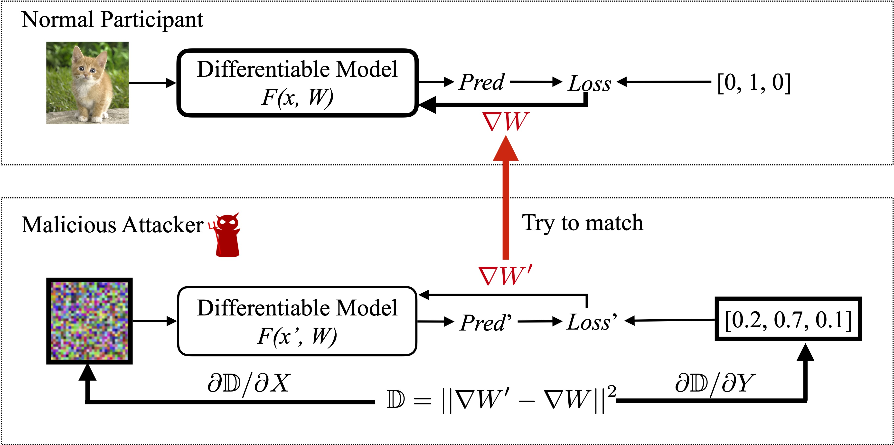

# Deep Leakage from Gradients

Note: The code here are minor modifications based on https://github.com/mit-han-lab/dlg. We acknowledge their contributions. 

## Original Paper

\[[paper](https://arxiv.org/abs/1906.08935)\]

\[[Website](https://hanlab.mit.edu/projects/dlg/)\]

## Introduction

Modern deep learning relies heavily on **Gradient Descent**. Given an arbitrary parameterized model $f_\theta()$ (e.g. a neural network, a logistic regression), a data-label pair $(x, y)$, a loss function $L(\hat{y}, y)$, the model can generally be trained in the form: 

$\theta\leftarrow \theta - \eta \nabla_\theta L(f_\theta(x), y), $

where $\eta$ is the learning rate. 

Modern multi-node learning systems (such as distributed learning, federated learning) commonly rely on exchanging gradients. For example, a typical distributed learning framework involves a server $S$ and several workers $W_i, i = 1, 2, ...$, each worker having dataset $D_i$. For training a model, the following procedure is carried out (maybe not exactly, but the general idea follows). 

(You can think of this scenario as: multiple hospitals would like to train a model for medical image diagnosis, yet no hospital want to directly share the data to other hospitals as this would compromise the privacy of the patients. Therefore, they choose to train models in distributed manners.)

- For each round $t = 1, ...T$ until convergence: 
    - Each worker samples a batch $(X_{it}, Y_{it})$ 
    - Each worker evaluates the gradient $g_{it} = \nabla_\theta L(f_{\theta_t}(X_{it}), Y_{it})$
    - Each worker submits the gradient $g_{it}$ to the server
    - The server computes an average of the gradients $g_t = \mathrm{MEAN}(g_{it})$
    - The server carries out a gradient step $\theta_{t+1}\leftarrow \theta_t - \eta g_t$
    - The server distributes new parameters $\theta_{t+1}$ to all workers

People usually consider exchanging gradients as safe and private. Indeed, it is safer than exchanging raw data. However, DLG claims that it is possible to **reconstruct** the input data given the gradients. Therefore, the privacy is leaked. 

<p align="center">
    
</p>

<p align="center">
    
</p>

## Overview

The core algorithm is to *match the gradients* between *dummy data* and *real data*.

<p align="center">
    
</p>

It can be implemented in **less than 20 lines** with PyTorch!


```python
def deep_leakage_from_gradients(model, origin_grad): 
  dummy_data = torch.randn(origin_data.size())
  dummy_label =  torch.randn(dummy_label.size())
  optimizer = torch.optim.LBFGS([dummy_data, dummy_label] )

  for iters in range(300):
    def closure():
      optimizer.zero_grad()
      dummy_pred = model(dummy_data) 
      dummy_loss = criterion(dummy_pred, F.softmax(dummy_label, dim=-1)) 
      dummy_grad = grad(dummy_loss, model.parameters(), create_graph=True)

      grad_diff = sum(((dummy_grad - origin_grad) ** 2).sum() \
        for dummy_g, origin_g in zip(dummy_grad, origin_grad))
      
      grad_diff.backward()
      return grad_diff
    
    optimizer.step(closure)
    
  return  dummy_data, dummy_label
```


# Prerequisites

To run the code, following libraies are required

* Python >= 3.6
* PyTorch >= 1.0
* torchvision >= 0.4

# Code

<!-- * If you do not have GPU mahcines, We provide [Google Colab](https://colab.research.google.com/gist/Lyken17/91b81526a8245a028d4f85ccc9191884/deep-leakage-from-gradients.ipynb) to quickly reproduce our results. 

* If you have GPU servers and would like to run your locally, `python main.py` provides the same functionality. -->

 <p align="center">Note: We provide 
    <a href="https://colab.research.google.com/gist/Lyken17/91b81526a8245a028d4f85ccc9191884/deep-leakage-from-gradients.ipynb" target="_parent"></a>
    for quick reproduction.
</p>

```
# Single image on MNIST
python main.py --index [0, 50000]
# Single image on CIFAR-10
python main.py --index [0, 50000] --data CIFAR10
# Single image on CIFAR-10, using iDLG (infers label first)
python main.py --index [0, 50000] --data CIFAR10 --alg iDLG
```


# What we want to do

There are the following issues that the paper (and the code) fails to address: 

- Both the paper and the code only study the case where the model is just initialized randomly.
    - In reality, it is possible to initialize a model using some pre-trained models, which presumably generates gradients of smaller magnitudes. 
- The paper states that it is possible to recover a batch. However, the code does not implement this function. 
    - It is good to try to implement that, as in reality, model training is carried out in mini-batches. 
    - It is also interesting to see how batch size influences the attack. 
- The paper fails to consider the effect of multi-step updates. In reality, to save costs, it is common not to communicate every round. Instead, communication is carried out when each worker iterates several batches over its local data. 
    - It is interesting to test DLG on that more realistic scenario. 
- The code only provides implementation of LeNet and ResNet. 
    - It is interesting to see how model architecture affects the attack. For example, do more parameters make it easier to attack, or harder? 
